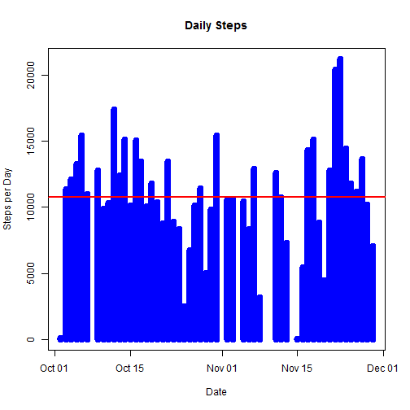
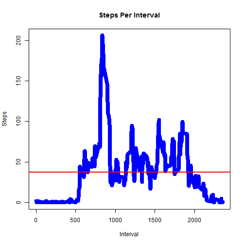
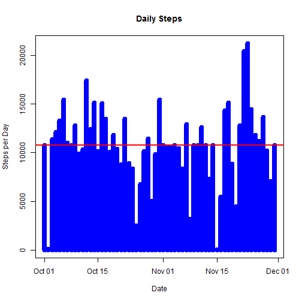
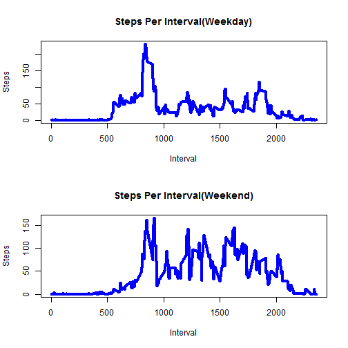

# Reproducible Research: Project Assignment 1

## Loading and preprocessing the data

```r
activity <- read.csv("activity.csv")
activity$date <- as.Date(activity$date)

activity_new<- na.omit(activity)
```

## What is mean total number of steps taken per day?

```r
agg  <-aggregate(activity_new$steps,list(activity_new$date),sum,na.rm=TRUE)
colnames(agg)<-c("date","steps")
mean <- mean(agg$steps)

plot(agg$date,agg$steps, type="h", main="Daily Steps", xlab="Date", ylab="Steps per Day", col="blue", lwd=8)
abline(h=mean, col="red", lwd=2)
```



Mean number of steps taken per day = 


```r
mean(agg$steps)
```

```
## [1] 10766.19
```

Median number of steps taken per day =

```r
median(agg$steps)
```

```
## [1] 10765
```

## What is the average daily activity pattern?

```r
agg2  <-aggregate(activity_new$steps,list(activity_new$interval),mean,na.rm=TRUE)
colnames(agg2)<-c("interval","steps")
mean2 <- mean(agg2$steps)

plot(agg2$interval,agg2$steps, type="l", main="Steps Per Interval", xlab="Interval", ylab="Steps", col="blue", lwd=8)
abline(h=mean2, col="red", lwd=2)
```



On average across all the days in the dataset, the 5-minute interval contains
the maximum number of steps?

Interval with max steps=

```r
max(agg2$steps)
```

```
## [1] 206.1698
```
Maximum interval with max steps =

```r
agg2$interval[which(agg2$steps == max(agg2$steps))]
```

```
## [1] 835
```

## Inputing missing values

The number of missing values=

```r
sum(is.na(activity$steps))
```

```
## [1] 2304
```

All of the missing values are filled in with mean value for that 5-minute
interval.


```r
# Replace each missing value with the mean value of its 5-minute interval

activity_replace <- activity

i <- 1

while (i < nrow(activity)+1){

  if(is.na(activity_replace[i,1])){  
    
      for (j in 1:288){

        activity_replace[i,1] <- agg2[j,2]
        i<-i+1
      }
  }
    
  else{  
      i<-i+288
  }  
  
}
```
Now, using the filled data set, let's make a histogram of the total number of steps taken each day and calculate the mean and median total number of steps.


```r
agg3  <-aggregate(activity_replace$steps,list(activity_replace$date),sum,na.rm=TRUE)
colnames(agg3)<-c("date","steps")
mean3 <- mean(agg3$steps)

plot(agg3$date,agg3$steps, type="h", main="Daily Steps", xlab="Date", ylab="Steps per Day", col="blue", lwd=8)
abline(h=mean3, col="red", lwd=2)
```



Mean number of steps taken per day = 

```r
mean(agg3$steps)
```

```
## [1] 10766.19
```

Median number of steps taken per day =

```r
median(agg3$steps)
```

```
## [1] 10766.19
```

Mean and median values are higher after inputing missing data. The reason is
that in the original data, there are some days with `steps` values `NA` for 
any `interval`. The total number of steps taken in such days are set to 0s by
default. However, after replacing missing `steps` values with the mean `steps`
of associated `interval` value, these 0 values are now higher than the original
from the histogram of total number of steps taken each day.

## Are there differences in activity patterns between weekdays and weekends?
First, let's find the day of the week for each measurement in the dataset. In
this part, we use the dataset with the filled-in values.


```r
activity_replace[,"day"] <- weekdays(activity$date)

activity_day <- activity_replace

i <- 1

while (i < nrow(activity_day)+1){

  if(activity_day[i,4] == "Saturday"){
		activity_day[i,4] <- "Weekend"
  }
  else if(activity_day[i,4] == "Sunday"){
		activity_day[i,4] <- "Weekend"
  }
  else{
		activity_day[i,4] <-"Weekday"
		}
  
  i<-i+1
}

activity_weekday <- subset(activity_day, activity_day$day == "Weekday")
activity_weekend <- subset(activity_day, activity_day$day == "Weekend")

agg4  <-aggregate(activity_weekday$steps,list(activity_weekday$interval),mean,na.rm=TRUE)
colnames(agg4)<-c("interval","steps")
mean4 <- mean(agg4$steps)

agg5  <-aggregate(activity_weekend$steps,list(activity_weekend$interval),mean,na.rm=TRUE)
colnames(agg5)<-c("interval","steps")
mean5<- mean(agg5$steps)
```

Now, let's make a panel plot containing plots of average number of steps taken
on weekdays and weekends.

```r
par(mfrow=c(2,1))
plot(agg4$interval,agg4$steps, type="l", main="Steps Per Interval(Weekday)", xlab="Interval", ylab="Steps", col="blue", lwd=4)
plot(agg5$interval,agg5$steps, type="l", main="Steps Per Interval(Weekend)", xlab="Interval", ylab="Steps", col="blue", lwd=4)
```


